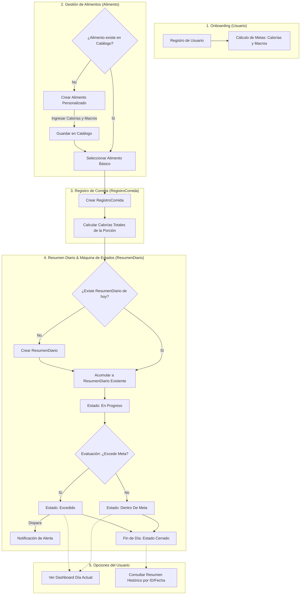

# FitTrack

                  *********** Diagrama de flujo ***********




                  *********** Diagrama Componentes ***********

```mermaid
flowchart TB
    subgraph WebAPI ["Contenedor: Web API (.NET)"]
        
        subgraph Core ["Capa Core (Fundación Transversal)"]
            CA["1. Control de acceso"]
            GP["2. Gestión de permisos"]
            MD["3. Manejador de documentos"]
            N["4. Notificaciones"]
            RA["5. Reportes con agregación"]
            AUD["6. Auditoría"]
        end

        subgraph ModuloNegocio ["Capa de Negocio"]
            GN["7. Gestor Nutricional\n(FitTrack)"]
        end

    end

    DB[("Base de Datos Persistente\n(SQL / EF Core)")]

    %% Relaciones del Módulo hacia el Core (Dependencia en un solo sentido)
    GN -->|"Consulta usuario activo mediante IControlAcceso"| CA
    GN -->|"Dispara alertas calóricas mediante INotificaciones"| N
    GN -->|"Registra cierre de día y cambios mediante IAuditoria"| AUD

    %% Persistencia (Base de Datos fuera del contenedor)
    CA -->|"Guarda usuarios y hashes de clave"| DB
    GP -->|"Guarda solicitudes de permisos"| DB
    MD -->|"Guarda metadatos de archivos"| DB
    N -->|"Guarda historial de alertas"| DB
    RA -->|"Lee métricas agrupadas"| DB
    AUD -->|"Guarda trazas de auditoría inmutables"| DB
    GN -->|"Guarda alimentos, registros y resúmenes diarios"| DB

    end
```
