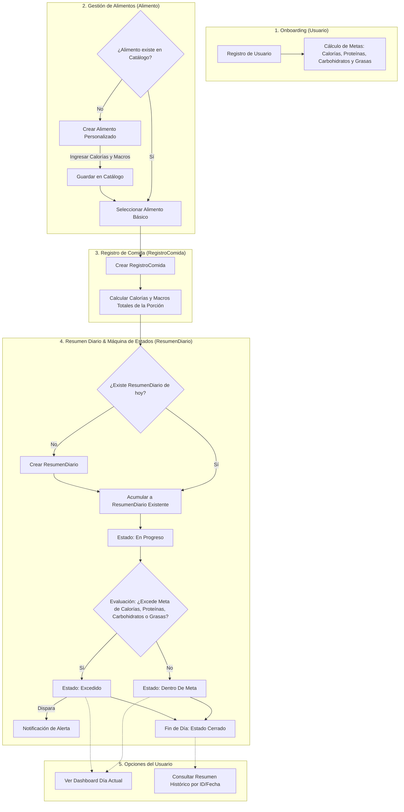
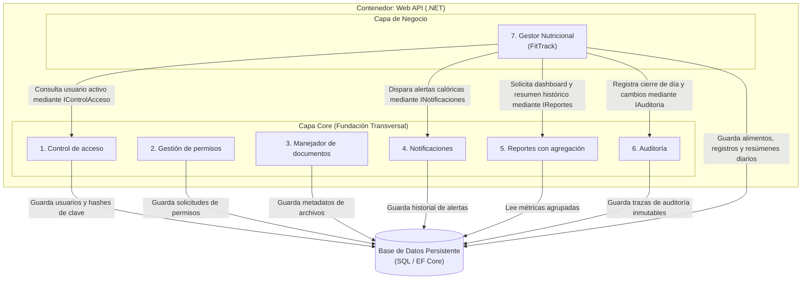
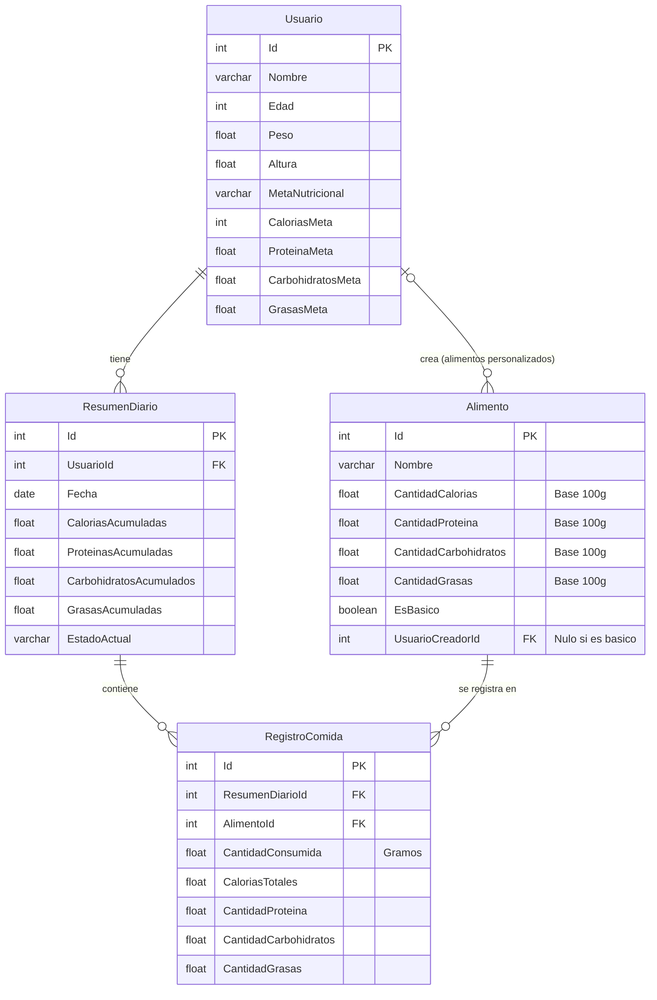

## FitTrack

**FitTrack** es un gestor de calorías y macronutrientes diseñado para brindar un control claro y preciso sobre la alimentación diaria. El sistema evalúa y calcula metas calóricas y de macronutrientes (proteínas, carbohidratos y grasas) personalizadas a partir de los datos del perfil del usuario (peso, altura, edad y objetivo nutricional: déficit, superávit o mantenimiento).

A través de un catálogo interactivo de alimentos —que integra opciones predeterminadas e ítems personalizados—, FitTrack permite registrar las porciones consumidas durante el día. El sistema consolida los datos en tiempo real, alerta mediante notificaciones cuando se alcanza o supera el tope diario, y ofrece un panel de control para consultar el consumo actual y el historial.

FitTrack es justamente lo que necesitas!!

---

## Entidades Principales

* **Usuario:** Representa el perfil, almacenando datos antropométricos y las metas calculadas de calorías y macronutrientes.

* **Alimento:** Catálogo de insumos nutricionales (básicos y personalizados) con sus valores de calorías, proteínas, carbohidratos y grasas.

* **RegistroComida:** Asocia un alimento y su porción consumida al día en curso, calculando los valores nutricionales aportados.

* **ResumenDiario:** Acumula el consumo diario del usuario y gestiona el estado del día (*En Progreso, Dentro de Meta, Excedido, Cerrado*).

---

## Tecnologías Utilizadas

* **Lenguaje:** C#

* **Framework:** .NET | ASP.NET Core

* **Acceso a Datos (ORM):** Entity Framework Core

* **Base de Datos:** Microsoft SQL Server

## Prerrequisitos

* .NET SDK

* Microsoft SQL Server

### Pasos de Instalación
```bash

git clone [https://github.com/carlosgabrielcastellanossuriel-lgtm/FitTrack.git](https://github.com/carlosgabrielcastellanossuriel-lgtm/FitTrack.git)

cd FitTrack

```

2. **Restaurar las dependencias del proyecto:**

```bash

dotnet restore

```

3. **Configurar la base de datos:**

Abre el archivo appsettings.json y actualiza la cadena de conexión con los datos de tu servidor SQL:

```json

"ConnectionStrings": {

"DefaultConnection": "Server=TU_SERVIDOR;Database=FitTrackDB;Trusted_Connection=True;TrustServerCertificate=True;"

}

```

4. **Aplicar las migraciones para crear la base de datos:**

```bash

dotnet ef database update

```

5. **Ejecutar la API:**

```bash

dotnet run

```
## Diagrama de flujo


**Diagrama Componentes**


**Diagrama Entidad-Relación**

